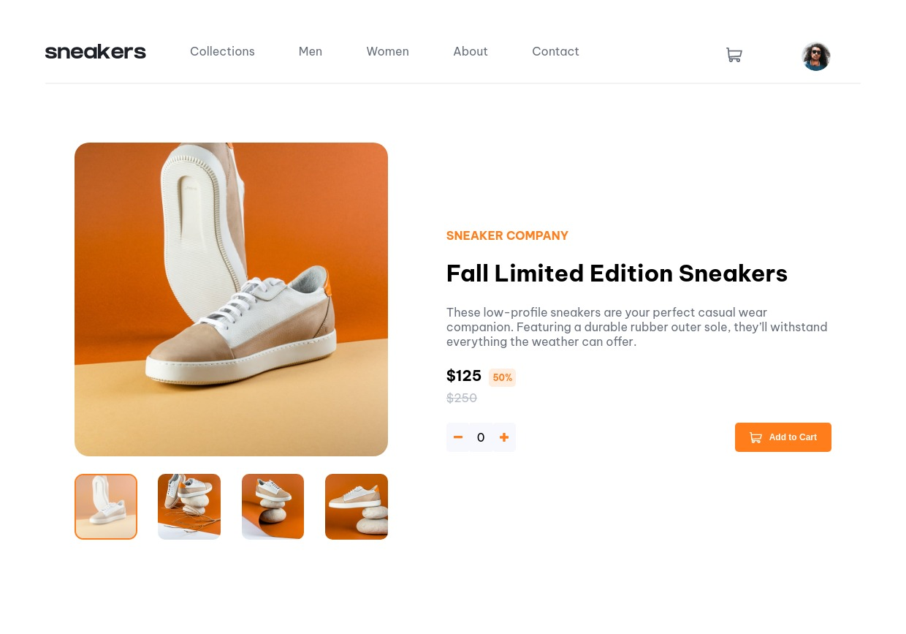

# Frontend Mentor - E-commerce product page solution

This is a solution to the [E-commerce product page challenge on Frontend Mentor](https://www.frontendmentor.io/challenges/ecommerce-product-page-UPsZ9MJp6). Frontend Mentor challenges help you improve your coding skills by building realistic projects.

## Table of contents

- [Overview](#overview)
  - [The challenge](#the-challenge)
  - [Screenshot](#screenshot)
  - [Links](#links)
- [My process](#my-process)
  - [Built with](#built-with)
  - [What I learned](#what-i-learned)
  - [Continued development](#continued-development)
  - [Useful resources](#useful-resources)
- [Author](#author)

## Overview

### The challenge

Users should be able to:

- View the optimal layout for the site depending on their device's screen size
- See hover states for all interactive elements on the page
- Open a lightbox gallery by clicking on the large product image
- Switch the large product image by clicking on the small thumbnail images
- Add items to the cart
- View the cart and remove items from it

### Screenshot



### Links

- Solution URL (Github): [https://github.com/kengitahi/product-page](https://github.com/kengitahi/product-page)
- Live Site URL (Netlify): [https://kengitahi-productpage.netlify.app](https://kengitahi-productpage.netlify.app)

## My process

### Built with

- Semantic HTML5 markup
- CSS custom properties
- Flexbox
- Mobile-first workflow
- Vanilla JavaScript

### What I learned

I learned how to use addEvenListener for multiple event listeners using single functions. For example:

```js
// Change image when thumbnail clicked
function changeMainImage(image, container) {
  container.forEach((thumbnail) => {
    thumbnail.addEventListener("click", function () {
      currentImage = thumbnail.id - 1;
      showMainImage(image, container, currentImage);
    });
  });
}
window.addEventListener(
  "DOMContentLoaded",
  changeMainImage(mainImage, thumbnailContainers)
);
window.addEventListener(
  "DOMContentLoaded",
  changeMainImage(modalImage, modalThumbnailContainers)
);
```

**Note: I know there is a better implementation for this and would be happy to be shwon a better way**

Learning how to refactor my JS to use fewer lines and nor repeat myself was alos a great lesson.

I also learned how to create a gallery using HTML, CSS and JavaScript

### Continued development

I would like to learn how to better position elements inside the cart modal, especially when empty

I would also like to learn how to create a modal without rep[eating myself

Learn how to use grid instead of relying in flex all the time

### Useful resources

- [EventTarget.addEventListener() from MDN](https://developer.mozilla.org/en-US/docs/Web/API/EventTarget/addEventListener) - This helped me learn everything there is to know about event listeners.
- [Avoiding anonymous JavaScript functions](https://ultimatecourses.com/blog/avoiding-anonymous-javascript-functions) - This is an amazing article which helped me finally understand why and how to avoid using anonymous functrions especually when usiing eventr listeners. It id also a great resource for learning how to pass arguements to the callback functions you use in your event listeners.
- [Disable event handler below a certain viewport width](https://stackoverflow.com/questions/30605696/disable-event-handler-below-a-certain-viewport-width) - Helped me to learn how to ensure the modal does not show on smaller devices

## Author

- Website - [Kennedy Gitahi](learningandworking.com)
- Frontend Mentor - [@kengitahi](https://www.frontendmentor.io/profile/yourusername)
- Github - [@kengitahi](https://www.frontendmentor.io/profile/kengitahi)
- Twitter - [@kennedy_gitahi](https://www.frontendmentor.io/profile/kengitahi)
